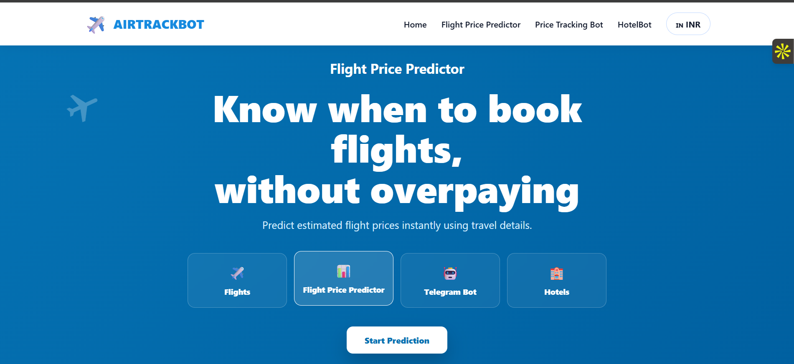
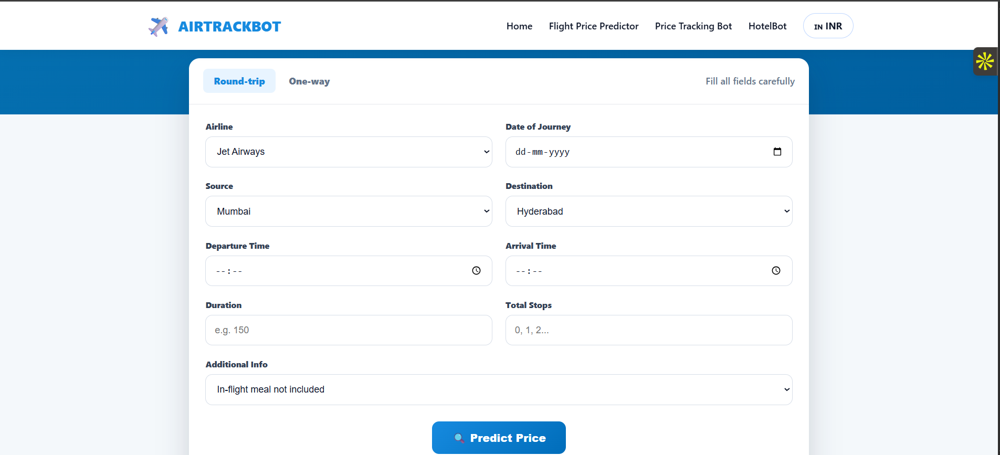

# ✈️ Flight Price Prediction System


---

## 🚀 Live Demo

🔗 https://your-app-name.onrender.com

---

## 📌 Overview

A **Machine Learning-powered Flight Price Predictor Web App** that estimates ticket prices based on travel details like airline, source, destination, timing, and stops.

👉 Built using **Flask + Scikit-Learn + Feature Engineering Pipelines**
👉 Clean modern UI inspired by real flight booking platforms

---

## 🎯 Key Features

✔ Predict flight prices instantly
✔ Clean & modern booking-style UI
✔ Input validation (frontend + backend)
✔ Feature engineering pipeline
✔ Model deployed using **Gunicorn + Render**
✔ Fully responsive UI

---

## 🧠 Machine Learning Details

### ✔ Problem Type

**Supervised Learning → Regression**

### ✔ Algorithms Used

* Random Forest Regressor 🌳
* (Pipeline based preprocessing)

### ✔ Libraries Used

* scikit-learn
* pandas
* numpy
* feature-engine

---

## 🧾 Sample Dataset Row

| Airline     | Source | Destination | Dep_Time | Arrival_Time | Duration | Total_Stops | Additional_Info | Price |
| ----------- | ------ | ----------- | -------- | ------------ | -------- | ----------- | --------------- | ----- |
| Jet Airways | Mumbai | Hyderabad   | 10:00    | 20:00        | 600      | 1           | No info         | ₹5620 |

---

## ⚙️ Feature Engineering

✔ Date split → Day / Month
✔ Time split → Hour / Minute
✔ Duration normalization
✔ One-Hot Encoding (Categorical Data)
✔ Scaling (StandardScaler)

---

## 🏗️ Architecture

```
User Input (Web Form)
        ↓
Flask Backend (app.py)
        ↓
Data Preprocessing Pipeline
        ↓
Trained ML Model (model.joblib)
        ↓
Prediction Output
        ↓
Rendered UI Response
```

## 🖼️ UI Preview  

### 🔹 Home Page  


### 🔹 Prediction Page  


## 📂 Project Structure

```
📁 Flight-Price-Predictor
│
├── 📁 templates
│   ├── layout.html
│   ├── home.html
│   └── predict.html
│
├── 📁 static
│   └── style.css
│
├── 📁 data
│
├── app.py
├── forms.py
├── model.joblib
├── requirements.txt
├── Procfile
└── README.md
```

---

## ⚡ Installation & Run Locally

```bash
git clone https://github.com/your-username/flight-price-predictor.git
cd flight-price-predictor

pip install -r requirements.txt

python app.py
```

---

## 🌐 Deployment

Deployed using:
✔ Render
✔ Gunicorn

Start Command:

```bash
gunicorn app:app
```

---

## 📊 Tech Stack

| Category      | Tech         |
| ------------- | ------------ |
| Backend       | Flask        |
| ML            | Scikit-Learn |
| Frontend      | HTML, CSS    |
| Deployment    | Render       |
| Model Storage | Joblib       |

---

## 🔥 Future Improvements

* Real-time flight API integration
* Price trend visualization 📈
* AI-based booking suggestions
* User login + tracking

---

## 🙌 Author

👨‍💻 Sanyam Jain
🎓 B.Tech CSE – IIIT Bhagalpur

---

## ⭐ If you like this project

Give it a ⭐ on GitHub and share it 🚀
